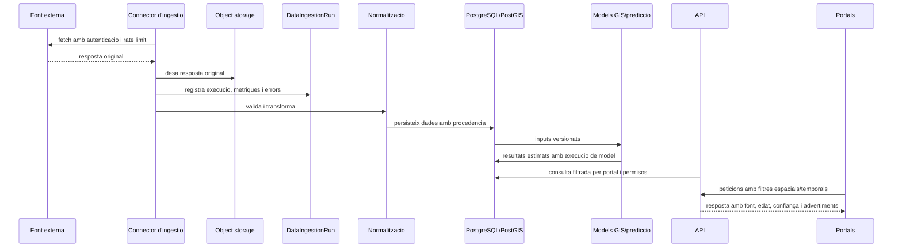
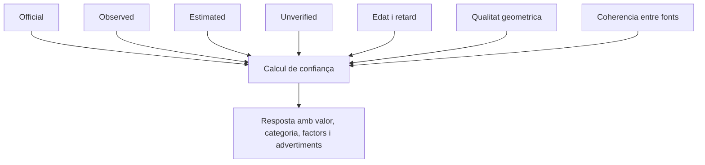

# Flux de dades

## Flux principal

## Etapes

1. Captura:
   Cada connector recupera dades externes amb autenticacio per variables d'entorn, timeouts, retries i idempotencia.

2. Conservacio original:
   La resposta bruta es desa abans de normalitzar-la per permetre auditoria, reprocessament i verificacio.

3. Validacio:
   Es comproven camps obligatoris, geometries, timestamps, unitats i cobertura.

4. Normalitzacio:
   Les dades es converteixen a formats interns, preservant CRS original, zona horaria original, data observada, publicada, rebuda i caducitat.

5. Persistencia:
   El domini conserva versions, procedencia, confidence score, metadades originals, hash de deduplicacio i timestamps.

6. Derivacio:
   Els motors geoespacials, de fum i routing creen resultats derivats. Aquests resultats no sobreescriuen dades originals ni oficials.

7. Publicacio:
   L'API exposa nomes els camps adequats a cada portal. El portal Civil rep informacio publica i el portal Bomber rep informacio operativa segons permisos.

## Procedencia i confiança

Les contradiccions entre fonts han de coexistir. La normalitzacio pot relacionar observacions, pero no ha d'eliminar registres contradictoris ni promoure estimacions a oficials.
