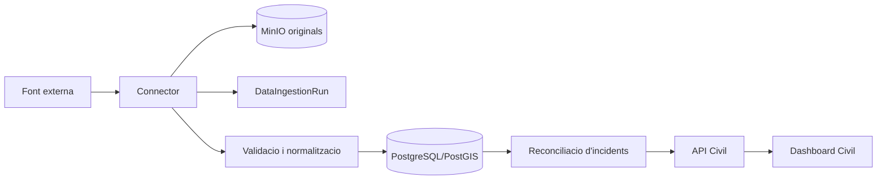

# Flux de dades

## Pipeline

1. El connector recupera la font amb timeout, retries i identificador d'execucio.
2. El payload original es conserva abans de normalitzar.
3. Es validen camps, geometria, temps, cobertura i coherencia minima.
4. La dada normalitzada conserva procedencia, CRS, temps observat/publicat/rebut, hash i metadata original.
5. La reconciliacio associa evidencies sense destruir registres originals.
6. L'API filtra camps interns i publica font, edat, confiança i advertiments.

## Reconciliacio d'incendis

Els poligons EFFIS recents formen la identitat espacial principal. Diversos poligons es poden agrupar en un incident quan coincideixen en temps i el veinatge calculat segons l'area, municipis, hashtags o evidencies OSINT ho justifica. FIRMS sempre es conserva i es mostra independentment, encara que quedi dins del perimetre.

Les publicacions s'associen per una combinacio de:

- hashtag;
- municipi exacte i context territorial;
- distancia a perimetres actius;
- proximitat temporal;
- tipus de risc i text.

Una coincidencia ambigua queda separada o entra a revisio humana. `Agost` no es geocodifica des de text lliure i els noms compostos tenen prioritat sobre coincidencies parcials.

## Integritat d'ingestio

Una execucio fallida, parcial, bloquejada (`DeadlockDetectedError`) o sospitosament buida no substitueix l'ultima instantania valida. El connector registra l'error i conserva el raw/dead-letter quan existeix. Locks consultius eviten processos concurrents sobre la mateixa font o carretera.

## Carreteres

DATEX aporta incidencia, carretera i PK. La geometria segueix aquest ordre:

1. xarxa IGR-RT CNIG local;
2. fusio i subseccio PostGIS dels trams del mateix `road_ref`;
3. punts PK oficials DGT;
4. Overpass o OSRM;
5. coordenades DATEX, etiquetades com a fallback de baixa fidelitat.

El reparador suporta taules CNIG sense clau primaria i actualitza tant `RestrictionZone` com `RoadSegment`.

## Procedencia

Les contradiccions coexisteixen. `official`, `observed`, `estimated` i `unverified` no son intercanviables. Una prediccio, una inferencia geografica o l'antiguitat d'un poligon no es converteixen automaticament en ordre oficial, enviament ES-Alert o extincio confirmada.
