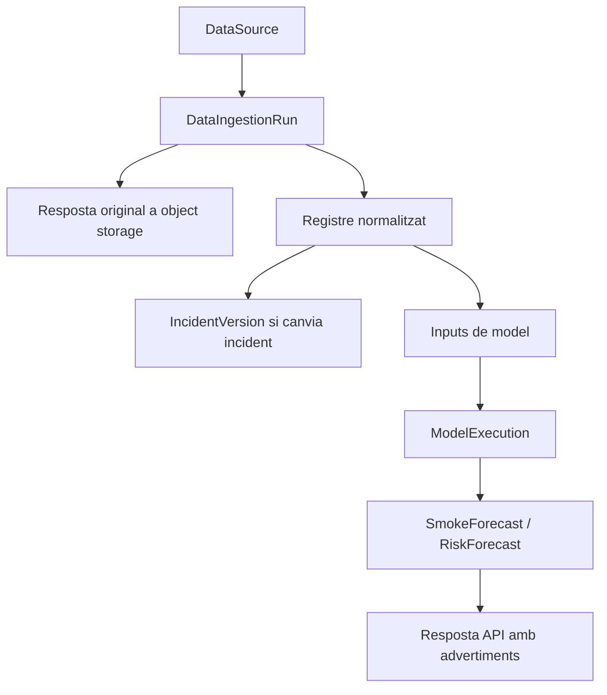

# Traçabilitat de dades

## Principis

- La dada original no es sobreescriu.
- Les contradiccions entre fonts poden coexistir.
- Una prediccio no es converteix automaticament en dada oficial.
- Els resultats estimats conserven inputs i execucio de model.
- Els canvis rellevants d'incident generen versions.

## Flux de lineage

## Tipus de procedencia

- `official`: comunicat o restriccio oficial.
- `observed`: observacio directa o satel·litaria.
- `estimated`: model, inferencia o prediccio.
- `unverified`: dada pendent de validacio.

## Contradiccions

El model permet que dues fonts mantinguin estats diferents per un mateix fenomen mitjançant `source_id`, `external_id`, timestamps i `provenance`. La reconciliacio canonica no elimina cap registre; `confidence_assessments`, links i conflictes en conserven el raonament.

## Prediccions

`SmokeForecast` i `RiskForecast` exigeixen `model_execution_id`. `ModelExecution` guarda:

- nom i versio del model;
- inputs referenciats;
- hash d'inputs;
- parametres;
- timestamps;
- estat;
- advertiments.

## Soft delete

`deleted_at` marca registres com inactius sense eliminar-los fisicament. Aixo permet auditoria, reprocessament i restauracio.
