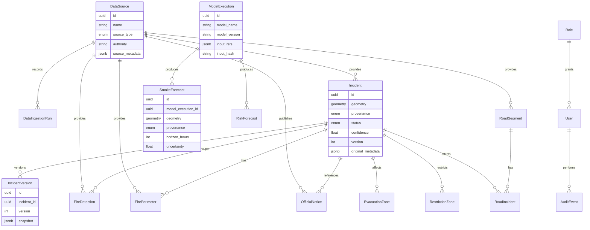

# Model de dades

Fase 2 implementa el domini persistent base. El model preserva originals, versions, procedencia i prediccions traçables. Les geometries internes usen PostGIS amb SRID 4326, mantenint `original_crs` quan la font arriba amb un CRS diferent.

## Entitats

## Camps comuns

Les entitats amb traçabilitat incorporen:

- `id`
- `source_id`
- `external_id`
- `provenance`
- `observed_at`
- `published_at`
- `received_at`
- `expires_at`
- `verification_status`
- `confidence`
- `version`
- `original_metadata`
- `deduplication_hash`
- `created_at`
- `updated_at`
- `deleted_at`

Les entitats geoespacials incorporen:

- `geometry`
- `original_crs`
- index GIST sobre `geometry`

## Regles d'integritat

- `provenance` admet `official`, `observed`, `estimated` i `unverified`.
- `confidence` queda acotada entre 0 i 1 quan existeix.
- `smoke_forecasts` i `risk_forecasts` no poden tenir procedencia oficial.
- Totes les prediccions apunten a `model_executions`.
- `incident_versions` conserva snapshots per no sobreescriure historia.
- `deleted_at` habilita soft delete sense perdre originals.

## Indexs

- GIST: totes les taules amb `geometry`.
- Temporals: `observed_at`, `published_at`, `received_at`, `expires_at`.
- Procedencia: `provenance`.
- Deduplicacio: `deduplication_hash`.
- Model: `model_name`, `model_version`, `input_hash`.
- Auditoria: `user_id`, `occurred_at`, `resource_type`, `resource_id`.
