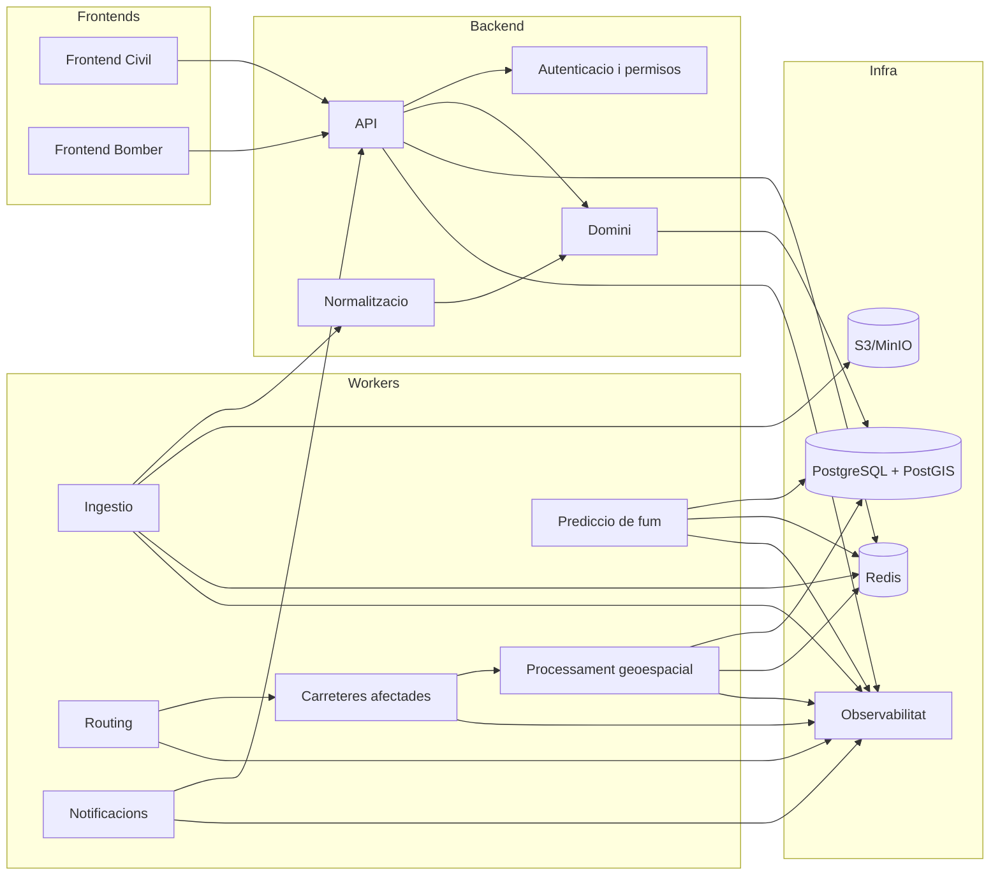

# Moduls tecnics

## Mapa de moduls

## Responsabilitats

Frontend Civil:
Interficie publica per mapa, incidents, avisos, evacuacions, restriccions, carreteres, risc i fum simplificat. Ha de prioritzar claredat, accessibilitat i evitar confusio entre dades oficials i estimades.

Es el modul prioritari fins assolir una versio publicable.

Frontend Bomber:
Interficie operativa protegida amb dashboard, mapa tecnic, control temporal, fonts, retard de dades, prediccions i routing. No comparteix permisos amb el portal Civil.

El seu desenvolupament queda ajornat fins a l'acceptacio explicita del Dashboard Civil publicable.

API:
Superficie HTTP amb endpoints publics i interns, validacio, errors consistents, correlation IDs, cache i OpenAPI. Ha de filtrar informacio sensible segons portal i rol.

Autenticacio:
OpenID Connect, sessions segures, RBAC, auditoria, revocacio i preparacio per MFA per al portal Bomber.

Ingestio:
Connectors idempotents per fonts externes, persistencia de resposta original, retries, rate limiting, metriques i registre d'execucions.

Normalitzacio:
Transformacio temporal, espacial i semantica, deduplicacio, preservacio de procedencia i calcul de qualitat.

Domini:
Model persistent d'incidents, versions, deteccions, perimetres, avisos, zones, carreteres, meteorologia, prediccions, usuaris i auditoria.

Processament geoespacial:
Operacions PostGIS/GDAL/Shapely/GeoPandas, indexs espacials, validacio, reparacio, buffers, interseccions i tiles.

Prediccio de fum:
Servei substituible que genera poligons probabilistics amb inputs, incertesa, versio i advertiments.

Deteccio de carreteres afectades:
Classificacio de trams segons perimetres, fum, restriccions, edat de dades i tipus de font.

Routing:
Motor autoallotjat amb perfil d'emergencia, exclusions, penalitzacions, alternatives i explicacio de costos.

Notificacions:
Esdeveniments en temps real amb permisos, deduplicacio, prioritat i traçabilitat.

Observabilitat:
Logs estructurats, metriques, traces, dashboards, alertes i runbooks.

Infraestructura:
Contenidors, xarxes internes, volums, health checks, CI/CD, backups i entorns reproduibles.

## Dependencies principals

- Els frontends depenen de l'API i dels contractes de dades.
- L'API depen del domini, autenticacio, cache, base de dades i object storage quan serveixi originals o adjunts.
- Els connectors depenen de configuracio segura, Redis/Celery, object storage i repositoris de domini.
- Normalitzacio depen dels connectors i alimenta el domini persistent.
- Prediccions, carreteres afectades i routing depenen de dades normalitzades, PostGIS i execucions versionades.
- Notificacions depenen dels canvis de domini i dels permisos.
- Observabilitat travessa tots els moduls.
