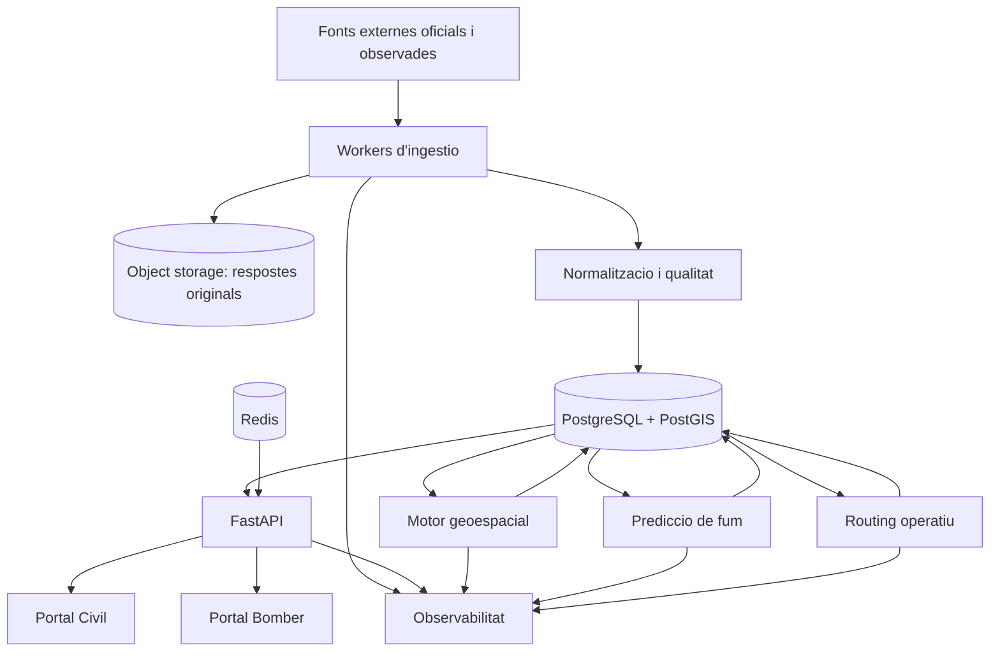

# Visio general d'arquitectura

## Context

La plataforma Wildfire Intelligence Platform integra fonts oficials, observades i estimades sobre incendis forestals per servir dos portals diferenciats:

- Portal Civil: informacio publica clara, traçable i segura.
- Portal Bomber: informacio operativa avançada per a serveis d'emergencia.

L'especificacio principal es mante a `EspecificacioProjecte.md`. Aquest document no en duplica tots els requisits; en resumeix l'arquitectura inicial per guiar la implementacio.

## Principis

- Les dades oficials, observades, estimades i no verificades han de quedar separades i etiquetades.
- Cap prediccio es pot presentar com a dada oficial.
- Les dades originals s'han de conservar per auditoria i reprocessament.
- Tots els resultats derivats han de mantenir traçabilitat de fonts, inputs, versions i timestamps.
- Les funcionalitats operatives del portal Bomber han d'estar protegides per autenticacio, permisos i auditoria.
- Quan falti documentacio oficial o entorn de proves, s'ha de registrar una decisio provisional abans d'implementar.

## Vista de sistema

## Estat inicial del repositori

El repositori conte nomes documents de planificacio i `.gitignore`. No hi ha encara codi executable, configuracio de runtime, dependecies, infraestructura, tests ni CI/CD.

Fitxers existents detectats:

- `.gitignore`
- `EspecificacioProjecte.md`
- `PlaDimplementacio.md`

No s'ha detectat `Structure.md` al disc, tot i apareixer com a pestanya oberta a l'IDE.

## Conflictes detectats

- L'especificacio descriu una arquitectura completa, pero el repositori encara no conte cap implementacio.
- El model seqüencial per fases es conserva nomes com a registre historic. La dependencia vigent es de producte: primer Dashboard Civil publicable i despres Dashboard per a Professionals.
- Les APIs externes enumerades requereixen documentacio oficial, condicions d'us i claus que encara no existeixen al repositori.
