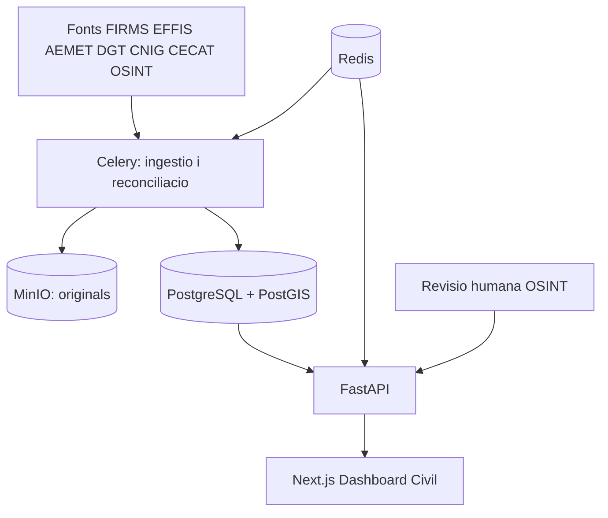

# Visio general d'arquitectura

Estat executable actual: consulta [`../current-state.md`](../current-state.md).

## Sistema

Docker Compose aixeca web, API, worker, beat, PostgreSQL/PostGIS, Redis i MinIO. El Dashboard Civil es el producte actiu. El portal professional, autenticacio OIDC, prediccio operativa i routing continuen ajornats.

## Principis vigents

- Separacio explicita entre dades oficials, observades, estimades i no verificades.
- Originals preservats per auditoria i reprocessament.
- Geometries internes en EPSG:4326 amb CRS original conservat.
- Un incident canonic agrega evidencies sense eliminar-ne la procedencia.
- Cap municipi, poligon, extincio o enviament ES-Alert s'inventa quan la font no ho confirma.
- Una ingestio fallida, parcial o sospitosament buida no substitueix l'ultima instantania valida.
- Fallades parcials de fonts externes no han de fer caure la resta del producte.

## Components implementats

- Next.js, TypeScript, TanStack Query i MapLibre.
- FastAPI, Pydantic, SQLAlchemy async i Alembic.
- Celery/Redis per ingestio periodica.
- PostgreSQL/PostGIS per consultes i reparacio geoespacial.
- MinIO compatible S3 per payloads originals.
- Connectors FIRMS, EFFIS, AEMET/CAP, IGN/CNIG, OSM, DATEX/eTraffic, CECAT i OSINT.

## Limitacions estructurals

- No existeix un registre public complet d'enviaments ES-Alert; la cobertura es una reconstruccio d'evidencies publiques.
- X requereix credencials; Nitter i TwitterViewer son passarel.les degradables, no APIs contractuals.
- EFFIS representa area cremada, no estat operatiu ni tasques d'extincio.
- Les fonts administratives espanyoles continuen fragmentades per territori.
