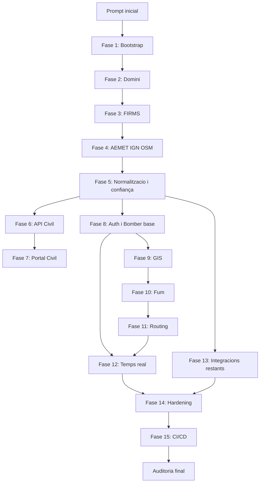

# Pla d'implementacio executable

## Resum de requisits principals

La plataforma ha d'integrar dades d'incendis, meteorologia, carreteres, cartografia i models predictius. Ha de conservar dades originals, normalitzar-les, versionar-les, calcular confiança explicable i exposar-les a dos portals: Civil, public i segur; Bomber, autenticat i operatiu. Les prediccions de foc, fum i routing son resultats estimats, traçables i mai equivalents a dades oficials.

Fonts previstes:

- NASA FIRMS
- Copernicus EFFIS
- MITECO
- 112 i comunitats autonomes
- AEMET
- CAMS/GFAS
- DGT i serveis de transit autonomics
- IGN/CNIG
- OpenStreetMap

## Estat actual del repositori

- No hi ha codi executable.
- No hi ha framework frontend o backend inicialitzat.
- No hi ha dependecies declarades.
- No hi ha infraestructura Docker.
- No hi ha tests, CI/CD ni migracions.
- `.gitignore`, `EspecificacioProjecte.md` i `PlaDimplementacio.md` encara no estan versionats segons `git status`.

## Ordre exacte d'implementacio

1. Bootstrap del monorepo:
   Crear `apps/web`, `apps/api`, workers, paquets compartits, Docker Compose, scripts, lint, typecheck, tests i documentacio inicial.

2. Domini, base de dades i traçabilitat:
   Implementar models SQLAlchemy, esquemes Pydantic, migracions PostGIS, repositoris, serveis, versionat i fixtures.

3. Framework d'ingestio i NASA FIRMS:
   Crear contracte generic de connectors i primer connector complet amb persistencia d'originals i deduplicacio.

4. Connectors meteorologics i geografics:
   Implementar AEMET, IGN/CNIG i OSM amb validacio espacial/temporal i documentacio de cobertura.

5. Normalitzacio, fusio i confiança:
   Afegir serveis independents per temps, espai, deduplicacio, agrupacio, contradiccions i confidence score.

6. API Civil:
   Exposar endpoints publics, segurs, cachejables i traçables sense dades sensibles.

7. Portal Civil complet:
   Implementar mapa, llistes, detall, accessibilitat, filtres i diferenciacio visual d'oficial/estimat.

8. Autenticacio i Portal Bomber base:
   Implementar OIDC, RBAC, auditoria i primera experiencia operativa protegida.

9. Motor geoespacial:
   Afegir operacions GIS reals, workers, validacions, tiles i proves amb resultats coneguts.

10. Model inicial de fum:
    Implementar model determinista substituible amb horizons, incertesa i traçabilitat.

11. Carreteres afectades i routing:
    Classificar trams, integrar motor autoallotjat i calcular rutes alternatives explicables.

12. Temps real i notificacions:
    Publicar canvis amb permisos, deduplicacio, reconnexio i alertes separades per portal.

13. Integracions oficials restants:
    Implementar EFFIS, CAMS/GFAS, DGT, MITECO, transit autonomic i 112 quan hi hagi documentacio revisada.

14. Observabilitat, seguretat i hardening:
    Afegir traces, metriques, dashboards, alertes, SAST, escaneigs, backups i proves de recuperacio.

15. CI/CD i desplegament:
    Crear pipelines de PR, staging i produccio amb aprovacio, migracions controlades, smoke tests i rollback.

16. Auditoria tecnica final:
    Executar revisio completa, corregir problemes critics/alts i emetre veredicte per staging o pilot.

## Dependencies entre fases

## Riscos principals

- Disponibilitat de dades externes: algunes fonts poden requerir claus, convenis, formats canviants o no tenir API publica estable.
- Qualitat i retard de dades: deteccions satel·litaries, meteorologia i avisos oficials poden arribar tard o amb resolucions diferents.
- Llicencies: IGN, OSM, Copernicus, NASA, DGT i fonts autonomiques poden imposar atribucio, redistribucio o limitacions d'us.
- Rendiment geoespacial: interseccions massives, tiles, raster i routing poden exigir indexs, workers i limits de memoria.
- Seguretat: el portal Bomber pot exposar dades operatives sensibles si els permisos i filtres no son estrictes.
- Falsa precisio: models de fum, risc i carreteres afectades poden ser interpretats com certeses si la UI no mostra incertesa i procedencia.
- APIs sense entorn de proves: integracions oficials poden requerir mocks, fixtures contractuals i mode manual fins disposar de sandbox.

## Preparacio per Fase 1

El repositori queda documentalment preparat per iniciar la Fase 1, pero encara no executivament preparat: no hi ha codi, dependecies ni serveis. La Fase 1 ha de crear la base executable completa abans de qualsevol funcionalitat de negoci.
